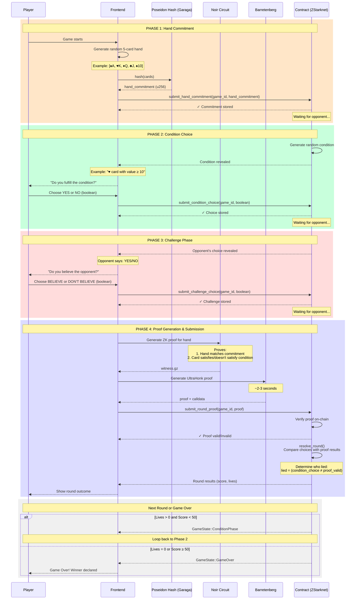
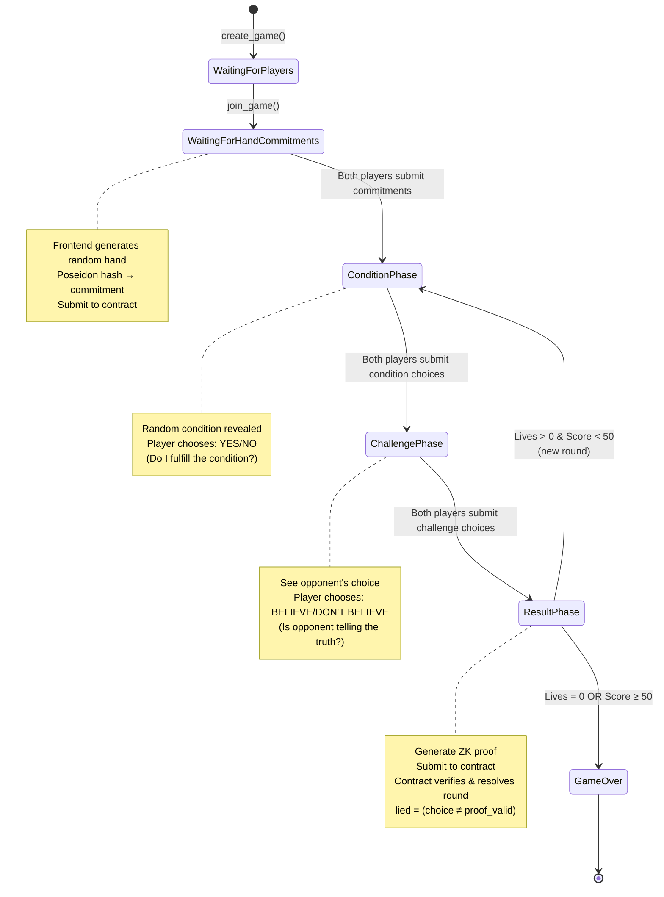
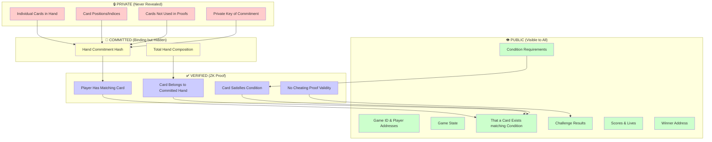
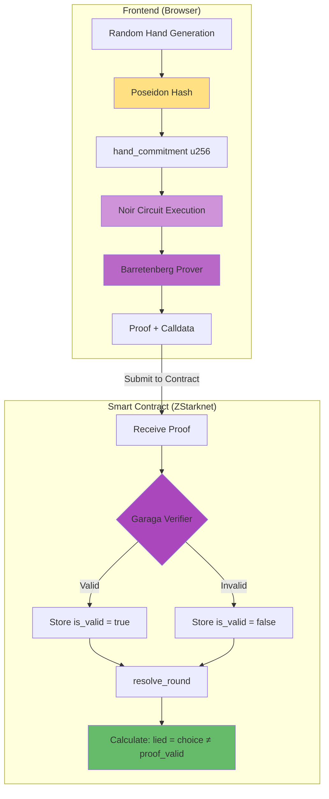
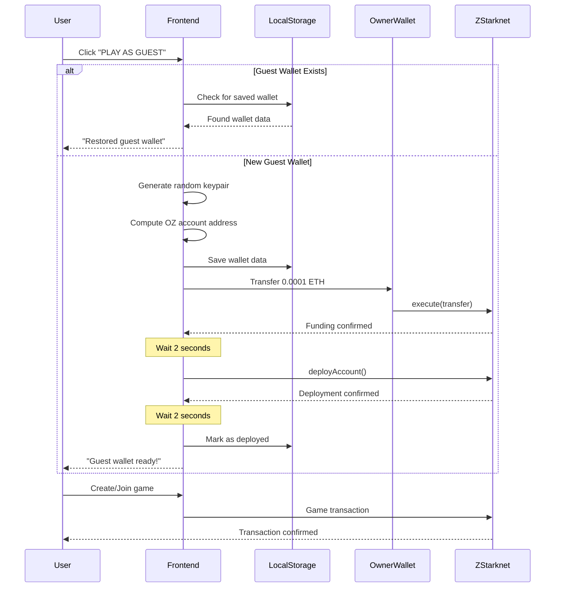

# Liar's Proof - Simplified Game Flow

This document shows the complete game flow from a single player's perspective, including:
- **Commitment Phase**: Random hand generation + Poseidon hash
- **Condition Phase**: Player declares YES/NO (do I fulfill the condition?)
- **Challenge Phase**: Player chooses to BELIEVE or DON'T BELIEVE opponent
- **Result Phase**: ZK proof generation and on-chain verification

The key logic: **A player lies when their claim doesn't match the proof result** → `lied = (condition_choice ≠ proof_valid)`

## Simplified Game Flow (Single Player View)



## Game Phases Summary

| Phase | Frontend Action | Contract Action | Output |
|-------|----------------|-----------------|--------|
| **1. Commitment** | Generate random hand → Poseidon hash | Store `hand_commitment` | Waiting for opponent |
| **2. Condition** | Player chooses YES/NO | Store `condition_choice` boolean | Reveal condition |
| **3. Challenge** | Player chooses BELIEVE/DON'T BELIEVE | Store `challenge_choice` boolean | Opponent's claim visible |
| **4. Result** | Generate ZK proof → Submit | Verify proof → Calculate `lied = (choice ≠ proof_valid)` → Resolve round | Score/lives updated |

## State Transition Diagram



## Privacy Zones



## ZK Proof Generation Pipeline



## Guest Wallet Flow



## Key Game Mechanics

### 🎮 Core Flow
1. **Commitment**: Frontend generates random hand → Poseidon hash → Submit to contract
2. **Condition**: Player declares YES (I fulfill) or NO (I don't fulfill)
3. **Challenge**: Player chooses to BELIEVE or DON'T BELIEVE opponent's claim
4. **Result**: Generate ZK proof → Verify on-chain → Resolve round

### 🎯 Lying Detection Logic
```
player_lies = (condition_choice ≠ proof_valid)
```

| Declared | Proof Valid | Result |
|----------|-------------|--------|
| YES (fulfill) | ✅ Valid | Telling truth |
| YES (fulfill) | ❌ Invalid | **LYING** |
| NO (don't fulfill) | ✅ Valid | **LYING** |
| NO (don't fulfill) | ❌ Invalid | Telling truth |

### 🏆 Scoring System
- **Caught lying**: Opponent gets +20 points, you lose 1 life
- **Successful lie**: You get +10 points
- **Wrong challenge**: You lose 1 life
- **Game ends**: Lives = 0 OR Score ≥ 50

### 🔐 Privacy
- **Zero-Knowledge**: Cards never revealed, only proven
- **Binding**: Cannot change hand after commitment (Poseidon hash)
- **On-chain verification**: Garaga verifier in Cairo contract

---

**Built with ZK privacy on ZStarknet 🔐**
