# Liar's Proof - Game State Flow Diagram

This diagram shows the complete flow of the Liar's Proof card game, including frontend interactions, ZK proof generation, and blockchain state transitions.

## Complete Game Flow

```mermaid
sequenceDiagram
    participant P1 as Player 1
    participant P2 as Player 2
    participant FE as Frontend
    participant Noir as Noir Circuit (WASM)
    participant BB as Barretenberg Prover
    participant BC as Blockchain (ZStarknet)
    participant Garaga as Garaga Verifier

    %% ==================== GAME CREATION ====================
    rect rgb(200, 220, 255)
    Note over P1,BC: Phase 1: Game Setup
    P1->>FE: Click "Create Game"
    FE->>BC: create_game(player_name)
    BC-->>FE: game_id, GameState::WaitingForPlayers
    FE-->>P1: "Waiting for opponent..."
    end

    %% ==================== JOIN GAME ====================
    rect rgb(200, 220, 255)
    P2->>FE: Enter game_id, Click "Join"
    FE->>BC: join_game(game_id, player_name)
    BC-->>FE: GameState::WaitingForHandCommitments
    FE-->>P1: "Player 2 joined!"
    FE-->>P2: "Joined game!"
    end

    %% ==================== HAND COMMITMENT (Player 1) ====================
    rect rgb(255, 230, 200)
    Note over P1,Garaga: Phase 2: Hand Commitment (Player 1)
    P1->>FE: Select 5 cards from deck
    Note over FE: Cards: [♠A, ♥K, ♦Q, ♣J, ♠10]

    FE->>FE: Compute hand_commitment = hash(cards)
    FE->>Noir: Execute circuit with hand
    Noir-->>FE: witness.gz

    FE->>BB: Generate UltraHonk proof (Starknet ZK mode)
    Note over BB: ~2-3 seconds
    BB-->>FE: proof (~200KB)

    FE->>FE: Format calldata with Garaga
    FE->>BC: submit_hand_commitment(game_id, commitment, proof)

    BC->>Garaga: verify_proof(proof, commitment)
    Garaga-->>BC: ✓ Valid
    BC-->>FE: Hand commitment stored
    FE-->>P1: "Commitment submitted! Waiting for Player 2..."
    end

    %% ==================== HAND COMMITMENT (Player 2) ====================
    rect rgb(255, 230, 200)
    Note over P2,Garaga: Phase 2: Hand Commitment (Player 2)
    P2->>FE: Select 5 cards from deck
    Note over FE: Cards: [♦A, ♣K, ♥J, ♠9, ♦8]

    FE->>FE: Compute hand_commitment = hash(cards)
    FE->>Noir: Execute circuit with hand
    Noir-->>FE: witness.gz

    FE->>BB: Generate UltraHonk proof
    BB-->>FE: proof

    FE->>FE: Format calldata with Garaga
    FE->>BC: submit_hand_commitment(game_id, commitment, proof)

    BC->>Garaga: verify_proof(proof, commitment)
    Garaga-->>BC: ✓ Valid
    BC-->>BC: Generate random condition
    BC-->>FE: GameState::ConditionPhase
    Note over BC: Condition: "♥ card with value ≥ 10"
    FE-->>P1: "Both committed! Condition: ♥ ≥ 10"
    FE-->>P2: "Both committed! Condition: ♥ ≥ 10"
    end

    %% ==================== PROVE CONDITION (Player 1) ====================
    rect rgb(200, 255, 220)
    Note over P1,Garaga: Phase 3: Condition Phase (Player 1)
    P1->>FE: Select matching card (♥K)
    Note over FE: Proving I have ♥K (satisfies ♥ ≥ 10)

    FE->>Noir: Execute circuit(hand, ♥K, condition, commitment)
    Note over Noir: Verify:<br/>1. commitment matches hand<br/>2. ♥K in hand<br/>3. ♥K satisfies condition
    Noir-->>FE: witness.gz

    FE->>BB: Generate proof
    BB-->>FE: proof

    FE->>FE: Format calldata
    FE->>BC: submit_condition_proof(game_id, proof)

    BC->>Garaga: verify_proof(proof, condition, commitment)
    Garaga-->>BC: ✓ Valid
    BC-->>FE: Proof submitted, waiting for Player 2
    FE-->>P1: "Proof submitted! Waiting for opponent..."
    end

    %% ==================== PROVE CONDITION (Player 2) ====================
    rect rgb(200, 255, 220)
    Note over P2,Garaga: Phase 3: Condition Phase (Player 2)
    P2->>FE: Select matching card (♥J)
    Note over FE: Proving I have ♥J (satisfies ♥ ≥ 10)

    FE->>Noir: Execute circuit(hand, ♥J, condition, commitment)
    Noir-->>FE: witness.gz

    FE->>BB: Generate proof
    BB-->>FE: proof

    FE->>FE: Format calldata
    FE->>BC: submit_condition_proof(game_id, proof)

    BC->>Garaga: verify_proof(proof, condition, commitment)
    Garaga-->>BC: ✓ Valid
    BC-->>FE: GameState::ChallengePhase
    FE-->>P1: "Challenge Phase: Truth or Liar?"
    FE-->>P2: "Challenge Phase: Truth or Liar?"
    end

    %% ==================== CHALLENGE PHASE ====================
    rect rgb(255, 220, 220)
    Note over P1,BC: Phase 4: Challenge Phase

    alt Player 1 Challenges Player 2
        P1->>FE: Click "Liar!" (challenge P2)
        FE->>BC: submit_challenge(game_id, challenged_player=P2)
        BC->>BC: Verify P2's proof again

        alt P2's proof is VALID
            BC-->>FE: P2 wins round, P1 loses 1 life
            FE-->>P1: "Challenge failed! You lose 1 life"
            FE-->>P2: "Challenge succeeded! You win the round"
        else P2's proof is INVALID
            BC-->>FE: P1 wins round, P2 loses 1 life
            FE-->>P1: "Challenge succeeded! You win the round"
            FE-->>P2: "Challenge failed! You lose 1 life"
        end

    else Both Accept (No Challenge)
        P1->>FE: Click "Truth" (accept)
        P2->>FE: Click "Truth" (accept)
        FE->>BC: both_accept(game_id)
        BC-->>FE: Round draw, no lives lost
        FE-->>P1: "Round accepted, no score change"
        FE-->>P2: "Round accepted, no score change"
    end
    end

    %% ==================== NEXT ROUND OR GAME OVER ====================
    rect rgb(240, 240, 240)
    Note over P1,BC: Phase 5: Result & Next Round

    BC->>BC: Check lives remaining

    alt Game Continues (both players have lives > 0)
        BC-->>FE: GameState::ConditionPhase
        BC->>BC: Generate new random condition
        Note over BC: New condition: "♣ card with value ≥ 8"
        FE-->>P1: "Next round! New condition: ♣ ≥ 8"
        FE-->>P2: "Next round! New condition: ♣ ≥ 8"
        Note over P1,P2: Game loops back to Condition Phase

    else Game Over (one player has 0 lives)
        BC-->>FE: GameState::GameOver
        BC-->>FE: winner_address, final_scores
        FE-->>P1: "Game Over! Winner: Player X"
        FE-->>P2: "Game Over! Winner: Player X"
    end
    end
```

## State Transition Diagram

## Privacy Zones

```mermaid
graph TB
    subgraph "🔒 PRIVATE (Never Revealed)"
        A1[Individual Cards in Hand]
        A2[Card Positions/Indices]
        A3[Cards Not Used in Proofs]
        A4[Private Key of Commitment]
    end

    subgraph "🔐 COMMITTED (Binding but Hidden)"
        B1[Hand Commitment Hash]
        B2[Total Hand Composition]
    end

    subgraph "👁️ PUBLIC (Visible to All)"
        C1[Game ID & Player Addresses]
        C2[Game State]
        C3[Condition Requirements]
        C4[That a Card Exists matching Condition]
        C5[Challenge Results]
        C6[Scores & Lives]
        C7[Winner Address]
    end

    subgraph "✅ VERIFIED (ZK Proof)"
        D1[Player Has Matching Card]
        D2[Card Belongs to Committed Hand]
        D3[Card Satisfies Condition]
        D4[No Cheating Proof Validity]
    end

    A1 --> B1
    A2 --> B1
    A3 --> B1
    A4 --> B1

    B1 --> D1
    B2 --> D2

    C3 --> D3

    D1 --> C4
    D2 --> C4
    D3 --> C4
    D4 --> C5

    style A1 fill:#ffcccc
    style A2 fill:#ffcccc
    style A3 fill:#ffcccc
    style A4 fill:#ffcccc

    style B1 fill:#ffffcc
    style B2 fill:#ffffcc

    style C1 fill:#ccffcc
    style C2 fill:#ccffcc
    style C3 fill:#ccffcc
    style C4 fill:#ccffcc
    style C5 fill:#ccffcc
    style C6 fill:#ccffcc
    style C7 fill:#ccffcc

    style D1 fill:#ccccff
    style D2 fill:#ccccff
    style D3 fill:#ccccff
    style D4 fill:#ccccff
```

## ZK Proof Generation Pipeline

## Guest Wallet Flow

```mermaid
sequenceDiagram
    participant User
    participant Frontend
    participant LocalStorage
    participant OwnerWallet
    participant ZStarknet

    User->>Frontend: Click "👤 PLAY AS GUEST"

    alt Guest Wallet Exists
        Frontend->>LocalStorage: Check for saved wallet
        LocalStorage-->>Frontend: Found wallet data
        Frontend-->>User: "Restored guest wallet"
    else New Guest Wallet
        Frontend->>Frontend: Generate random keypair
        Frontend->>Frontend: Compute OZ account address
        Frontend->>LocalStorage: Save wallet data

        Frontend->>OwnerWallet: Transfer 0.0001 ETH
        OwnerWallet->>ZStarknet: execute(transfer)
        ZStarknet-->>Frontend: Funding confirmed

        Note over Frontend: Wait 2 seconds

        Frontend->>ZStarknet: deployAccount()
        ZStarknet-->>Frontend: Deployment confirmed

        Note over Frontend: Wait 2 seconds

        Frontend->>LocalStorage: Mark as deployed
        Frontend-->>User: "Guest wallet ready!"
    end

    User->>Frontend: Create/Join game
    Frontend->>ZStarknet: Game transaction
    ZStarknet-->>User: Transaction confirmed
```

## Key Features

### 🔐 Privacy Guarantees
- **Zero-Knowledge**: Cards never revealed, only possession proven
- **Commitment Binding**: Cannot change hand after commitment
- **Verifiable**: All claims verified on-chain without revealing private data

### ⚡ Performance
- **Proof Generation**: ~2-3 seconds (client-side)
- **On-Chain Verification**: ~2-3 seconds (~500K gas)
- **Guest Wallet Setup**: ~6-8 seconds (one-time)

### 🎮 Game Mechanics
- **Lives System**: 3 lives per player
- **Challenge System**: Call bluff or accept claims
- **Random Conditions**: Fair condition generation on-chain
- **Score Tracking**: Persistent leaderboard

---

**Built with privacy, powered by Zero-Knowledge Proofs on ZStarknet 🔐**
