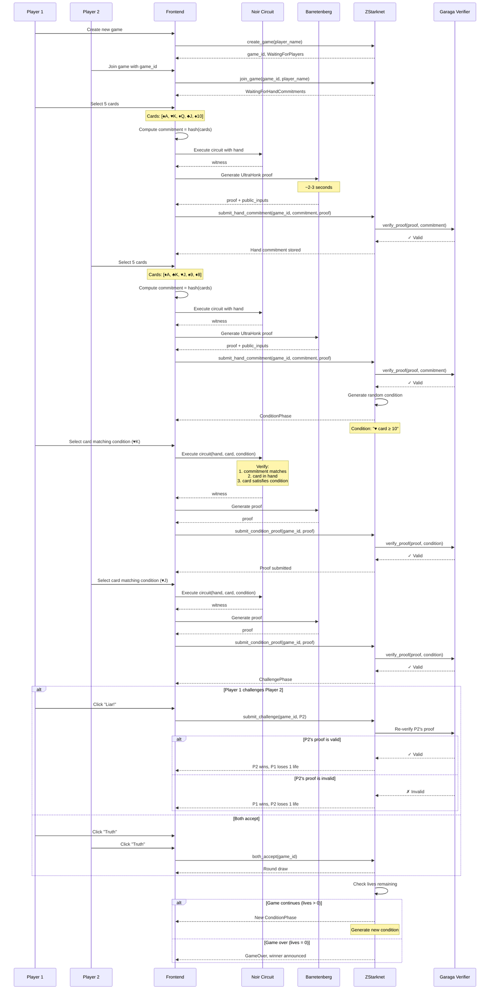

# Liar's Proof - Privacy-Preserving Card Game on ZStarknet

> A fully on-chain card game leveraging Zero-Knowledge Proofs for private hand commitments, built for the [Zypherpunk Hackathon](https://zypherpunk.xyz/)


## 🎯 Overview

**Liar's Proof** is a privacy-focused, fully on-chain card game that demonstrates the power of Zero-Knowledge Proofs in gaming. Players can make claims about their cards without revealing them, and prove the validity of their claims using ZK circuits powered by Noir and Garaga.

### 🔐 Privacy First

The game showcases practical privacy-preserving gaming mechanics:
- **Private Hand Commitments**: Players commit to their cards without revealing them
- **Verifiable Claims**: Make provable statements about hidden cards using ZK proofs
- **On-Chain Verification**: All proofs verified on ZStarknet using Cairo verifier contracts
- **No Trusted Setup**: Leveraging Noir's UltraHonk proving system

## 🏗️ Architecture

### Technology Stack

- **ZK Circuit**: Noir 1.0.0-beta.5 for hand verification logic
- **Proof System**: Barretenberg UltraHonk with Starknet ZK mode
- **Verifier Generation**: Garaga 0.18.0 (Noir → Cairo contract)
- **Smart Contracts**: Cairo 2.13.1 with Dojo 1.8.0 ECS framework
- **Frontend**: React 18 + TypeScript + Vite
- **Blockchain**: Deployed on ZStarknet (Madara-based testnet)

### System Architecture

```
┌─────────────────────────────────────────────────────────────────┐
│                         Player Client                            │
│  ┌────────────┐  ┌─────────────┐  ┌──────────────────────┐    │
│  │   Hand     │─>│ Noir Circuit │─>│ Barretenberg Prover  │    │
│  │ Selection  │  │   (WASM)     │  │    (UltraHonk)       │    │
│  └────────────┘  └─────────────┘  └──────────────────────┘    │
│                                              │                   │
│                                              +                   │
│                                    ┌──────────────────┐         │
│                                    │  Garaga Calldata │         │
│                                    │    Formatter     │         │
│                                    └──────────────────┘         │
└────────────────────────────────────────────┬────────────────────┘
                                             │
                                             +
┌─────────────────────────────────────────────────────────────────┐
│                         ZStarknet                                │
│  ┌────────────────┐         ┌──────────────────────────┐       │
│  │  Dojo World    │         │   Garaga Verifier        │       │
│  │  (Game Logic)  │◄────────│  (Cairo Contract)        │       │
│  │                │         │                          │       │
│  │ • Game State   │         │ • UltraHonk Verification │       │
│  │ • Player Turns │         │ • Starknet ZK Mode       │       │
│  │ • Commitments  │         │ • Public Input Checking  │       │
│  └────────────────┘         └──────────────────────────┘       │
│                                                                  │
│  ┌─────────────────────────────────────────────────────────┐  │
│  │              Torii Indexer (GraphQL)                     │  │
│  └─────────────────────────────────────────────────────────┘  │
└─────────────────────────────────────────────────────────────────┘
```

## 🎮 Game Flow Diagram

Complete sequence diagram showing the entire game flow from creation to end, including ZK proof generation and verification:



## 🔬 Zero-Knowledge Circuit

### Circuit Logic (Noir)

The heart of the privacy mechanism is the Noir circuit that proves card possession without revealing the card:

```noir
// Simplified representation of the hand verification circuit
fn verify_hand_condition(
    // Private inputs (never revealed on-chain)
    hand: [Card; 5],              // Player's 5 cards
    card_index: u8,               // Which card satisfies condition

    // Public inputs (verified on-chain)
    hand_commitment: Field,       // Hash of entire hand
    condition_suit: u8,           // Required suit
    condition_value: u8,          // Minimum value
    game_id: Field,               // Game identifier
) -> bool {
    // 1. Verify the hand commitment matches
    let computed_commitment = poseidon_hash(hand);
    assert(computed_commitment == hand_commitment);

    // 2. Verify the selected card meets the condition
    let selected_card = hand[card_index];
    assert(selected_card.suit == condition_suit);
    assert(selected_card.value >= condition_value);

    // 3. Verify card is valid (not duplicate, in valid range)
    assert(is_valid_card(selected_card));
    assert(no_duplicates_in_hand(hand));

    true
}
```

### Proof Generation Flow

```
┌────────────────────────────────────────────────────────────────┐
│                    Client-Side (Browser)                        │
│                                                                 │
│  Step 1: Player Input                                          │
│  ┌─────────────────────────────────────────────────────────┐  │
│  │ Hand: [♠A, ♥K, ♦Q, ♣J, ♠10]                            │  │
│  │ Condition: Suit=HEARTS, Value>=10                        │  │
│  │ Selected Card: ♥K (index=1, satisfies condition)        │  │
│  └─────────────────────────────────────────────────────────┘  │
│                          │                                      │
│                          +                                      │
│  Step 2: Noir Circuit Execution (WASM)                         │
│  ┌─────────────────────────────────────────────────────────┐  │
│  │ • Load circuit.json (compiled Noir circuit)              │  │
│  │ • Prepare witness data from inputs                       │  │
│  │ • Execute circuit constraints                            │  │
│  │ • Generate witness file                                  │  │
│  │ ⏱️  ~500ms                                                │  │
│  └─────────────────────────────────────────────────────────┘  │
│                          │                                      │
│                          +                                      │
│  Step 3: Barretenberg Proof Generation                         │
│  ┌─────────────────────────────────────────────────────────┐  │
│  │ • Initialize UltraHonk prover                            │  │
│  │ • Generate proof with Starknet ZK mode                   │  │
│  │ • Proof size: ~200KB                                     │  │
│  │ ⏱️  ~2-3 seconds (first run ~5s due to WASM init)       │  │
│  └─────────────────────────────────────────────────────────┘  │
│                          │                                      │
│                          +                                      │
│  Step 4: Garaga Calldata Formatting                            │
│  ┌─────────────────────────────────────────────────────────┐  │
│  │ • Serialize proof for Cairo contract                     │  │
│  │ • Format public inputs                                   │  │
│  │ • Generate optimized calldata                            │  │
│  │ ⏱️  ~100ms                                                │  │
│  └─────────────────────────────────────────────────────────┘  │
└────────────────────────────────────────────────────────────────┘
                          │
                          +
┌────────────────────────────────────────────────────────────────┐
│                    ZStarknet Blockchain                         │
│                                                                 │
│  Step 5: On-Chain Verification                                 │
│  ┌─────────────────────────────────────────────────────────┐  │
│  │ Garaga Verifier Contract (Cairo)                         │  │
│  │ • Verify UltraHonk proof                                 │  │
│  │ • Check public inputs match game state                   │  │
│  │ • Validate commitment hasn't been used before            │  │
│  │ ⏱️  ~500K gas, ~2-3 seconds                              │  │
│  └─────────────────────────────────────────────────────────┘  │
│                          │                                      │
│                          +                                      │
│  Step 6: Game State Update                                     │
│  ┌─────────────────────────────────────────────────────────┐  │
│  │ Dojo Game Contract (Cairo)                               │  │
│  │ • Update game state with verified proof                  │  │
│  │ • Progress to next phase                                 │  │
│  │ • Emit events for frontend                               │  │
│  └─────────────────────────────────────────────────────────┘  │
└────────────────────────────────────────────────────────────────┘
```

### Privacy Guarantees

**What remains private:**
- ✅ Individual cards in your hand
- ✅ Position of cards that satisfy conditions
- ✅ Cards you don't use in proofs

**What is public:**
- ✅ Hand commitment (hash)
- ✅ That you possess a card matching the condition
- ✅ The condition itself
- ✅ Game outcomes and scores

**Security properties:**
- ✅ **Soundness**: Cannot prove false statements (forged proofs rejected)
- ✅ **Zero-Knowledge**: No information leaked beyond the claim
- ✅ **Non-malleable**: Proofs cannot be modified or replayed
- ✅ **Commitment Binding**: Cannot change hand after commitment

Already deployed! Visit the live demo:
- **Game**: https://liars-proof.vercel.app
- **Explorer**: https://explorer-zstarknet.d.karnot.xyz

### Playing as Guest

We've implemented a **Guest Wallet** feature for seamless onboarding:

1. Click **"PLAY AS GUEST"** on the login page
2. A wallet is automatically generated and funded
3. Start playing immediately - no wallet extension required!

**How it works:**
- Generates OpenZeppelin account with random keypair
- Auto-funded from owner wallet (0.0001 ETH)
- Auto-deployed on first transaction
- Persists in localStorage for returning players

## 🎲 How to Play

### Step 1: Connect Wallet
- Use Ready/Braavos wallet, or
- Click "Play as Guest" for instant access

### Step 2: Create or Join Game
- **Create**: Start a new game and wait for opponent
- **Join**: Enter game ID to join existing game

### Step 3: Select Your Hand
- Choose 5 cards from the deck
- Cards are committed privately using ZK proof
- Opponent cannot see your selection

### Step 4: Prove Your Claims
- Each round presents a condition (e.g., "♥ card with value ≥ 10")
- Generate ZK proof that you have a matching card
- Submit proof to smart contract

### Step 5: Challenge or Accept
- Challenge opponent if you think they're bluffing
- Accept to progress to next round
- Invalid proofs result in instant loss!

### Step 6: Win the Game
- First player to reduce opponent to 0 lives wins
- Each won round: +1 score for winner, -1 life for loser
- Strategy: Know when to bluff and when to challenge!

---

**Built with privacy, powered by Caravana Studio. 🔐**
