# Liar's Proof - Privacy-Preserving Card Game on ZStarknet

> A fully on-chain card game leveraging Zero-Knowledge Proofs for private hand commitments, built for the [Zypherpunk Hackathon](https://zypherpunk.xyz/)


## 🎯 The Problem Liar's Proof Solves

### Privacy in On-Chain Gaming

Traditional on-chain games face a fundamental privacy problem: **all game state is publicly visible on the blockchain**. This eliminates strategic gameplay, makes games predictable, and prevents classic game mechanics like hidden cards, secret moves, or private information.

**Liars Proof solves this** by enabling privacy-preserving on-chain games where players can:

- ✅ Keep their cards completely hidden from opponents
- ✅ Make verifiable claims about hidden information
- ✅ Prove statements without revealing underlying data
- ✅ Play strategically without information leakage

### Zero-Knowledge Proofs for Gaming

#### The Challenge

How do you verify that a player has a specific card (e.g., "a Heart card with value ≥ 10") without revealing:

- Which exact card they have
- Their entire hand
- Any other private information

#### Our Solution

Using **Zero-Knowledge Proofs**, players can:

1. **Commit to their hand privately** (cryptographic hash using Poseidon)
2. **Claim they fulfill conditions** (e.g., "I have a Heart ≥ 10")
3. **Prove their claim with a ZK proof** that verifies:
   - The claim is true
   - The proof matches their committed hand
   - **Without revealing the actual cards**

#### Problems Solved

✅ **No Cheating**: Cryptographic proofs prevent players from lying about their cards
✅ **No Information Leakage**: Opponents learn nothing beyond what you claim
✅ **Verifiable Fairness**: All game logic is on-chain and auditable
✅ **Trustless**: No need for trusted intermediaries or servers

### Making On-Chain Games Practical

**Before Liars Proof:**

❌ All game state visible → No strategy possible
❌ No hidden information → Can't implement classic game mechanics

**With Liars Proof:**

✅ Private game state → Strategic gameplay possible
✅ Verifiable claims → Fair and secure with ZK
✅ Hidden information → Classic game mechanics work on-chain

## 🚧 Challenges I Ran Into

### Network Instability & Transaction Failures

#### The Problem

Working with ZStarknet (a testnet) presented significant challenges:

- **Frequent transaction rejections**: Transactions would fail unpredictably
- **Network instability**: Connections dropping during critical operations

#### The Solution

We implemented robust retry logic and transaction verification:

**Key improvements:**

✅ **Automatic retry** with up to 20 attempts
✅ **Transaction verification** before moving to next phase
✅ **Better error handling** and user feedback
✅ **Exponential backoff** to avoid overwhelming the network

### Wallet Integration Challenges

#### The Problem

Integrating wallets (Ready/Braavos/Controller) with ZStarknet was difficult:

- **Network configuration**: Users had to manually configure custom RPC endpoints
- **Poor UX**: Required technical knowledge to set up correctly
- **High friction**: Many users gave up before playing

#### The Solution

We built a **Guest Wallet** that eliminates the need for manual wallet setup:

**Features:**

✅ **Auto-generated wallets**: Create a Ready wallet with one click
✅ **Automatic funding**: Wallet is funded from an owner account (0.0001 Ztf)
✅ **Auto-deployment**: Account contract deployed automatically on first use
✅ **Persistent storage**: Wallet saved in localStorage for returning players
✅ **Seamless experience**: Users can start playing immediately

**Impact:**

- **Zero setup time**: Users can play in seconds, not minutes
- **Better conversion**: No technical barriers to entry
- **Fallback option**: Even experienced users prefer guest mode for quick testing

## 🎮 Game Flow

The key logic: **A player lies when their claim doesn't match the proof result** → `lied = (condition_choice ≠ proof_valid)`

### Phase 1: Hand Commitment

```mermaid
sequenceDiagram
    participant P as Player
    participant FE as Frontend
    participant Poseidon as Poseidon Hash (Garaga)
    participant BC as Contract (ZStarknet)

    P->>FE: Game starts
    FE->>FE: Generate random 5-card hand
    Note over FE: Example: [♥4, ♦3, ♣J]

    FE->>Poseidon: hash(cards)
    Poseidon-->>FE: hand_commitment (u256)

    FE->>BC: submit_hand_commitment(game_id, hand_commitment)
    BC-->>FE: ✓ Commitment stored
    Note over BC: Waiting for opponent...
```



### Phase 2: Condition Choice

```mermaid
sequenceDiagram
    participant P as Player
    participant FE as Frontend
    participant BC as Contract (ZStarknet)

    BC->>BC: Generate random condition
    BC-->>FE: Condition revealed
    Note over FE: Example: "♥ card with value ≥ 10"

    FE-->>P: "Do you fulfill the condition?"
    P->>FE: Choose YES or NO (boolean)

    FE->>BC: submit_condition_choice(game_id, boolean)
    BC-->>FE: ✓ Choice stored
    Note over BC: Waiting for opponent...
```



### Phase 3: Challenge Phase


### Phase 4: Proof Generation & Submission

```mermaid
sequenceDiagram
    participant P as Player
    participant FE as Frontend
    participant Noir as Noir Circuit
    participant BB as Barretenberg
    participant BC as Contract (ZStarknet)

    FE->>Noir: Generate ZK proof for hand
    Note over Noir: Proves:<br/>1. Hand matches commitment<br/>2. Card satisfies/doesn't satisfy condition
    Noir-->>FE: witness.gz

    FE->>BB: Generate UltraHonk proof
    BB-->>FE: proof + calldata

    FE->>BC: submit_round_proof(game_id, proof)
    BC->>BC: Verify proof on-chain
    BC-->>FE: ✓ Proof valid/invalid

    BC->>BC: resolve_round()<br/>Compare choices with proof results
    Note over BC: Determine who lied:<br/>lied = (condition_choice ≠ proof_valid)

    BC-->>FE: Round results (score, lives)
    FE-->>P: Show round outcome
```



### Next Round or Game Over

```mermaid
sequenceDiagram
    participant FE as Frontend
    participant BC as Contract (ZStarknet)
    participant P as Player

    alt Lives > 0 and Score < 50
        BC-->>FE: GameState::ConditionPhase
        FE-->>P: New round starts!
        Note over P,BC: Loop back to Phase 2
    else Lives = 0 or Score ≥ 50
        BC-->>FE: GameState::GameOver
        FE-->>P: Game Over! Winner declared
    end
```



### Lying Detection Logic

```
player_lies = (condition_choice ≠ proof_valid)
```

| Declared | Proof Valid | Result |
|----------|-------------|--------|
| YES (fulfill) | ✅ Valid | Telling truth |
| YES (fulfill) | ❌ Invalid | **LYING** |
| NO (don't fulfill) | ✅ Valid | **LYING** |
| NO (don't fulfill) | ❌ Invalid | Telling truth |

### Scoring System

- **Caught lying**: Opponent gets +20 points, you lose 1 life
- **Successful lie**: You get +10 points
- **Wrong challenge**: You lose 1 life
- **Game ends**: Lives = 0 OR Score ≥ 50

## 🏗️ Architecture

### Technology Stack

- **ZK Circuit**: Noir 1.0.0-beta.5 for hand verification logic
- **Proof System**: Barretenberg UltraHonk with Starknet ZK mode
- **Verifier Generation**: Garaga 0.18.0 (Noir → Cairo contract)
- **Smart Contracts**: Cairo 2.13.1 with Dojo 1.8.0 ECS framework
- **Frontend**: React 18 + TypeScript + Vite
- **Blockchain**: Deployed on ZStarknet (Madara-based testnet)

### Privacy Guarantees

**What remains private:**
- ✅ Individual cards in your hand
- ✅ Position of cards that satisfy conditions
- ✅ Cards you don't use in proofs

**What is public:**
- ✅ Hand commitment (Poseidon hash)
- ✅ That you possess a card matching the condition
- ✅ The condition itself
- ✅ Game outcomes and scores

**Security properties:**
- ✅ **Soundness**: Cannot prove false statements (forged proofs rejected)
- ✅ **Zero-Knowledge**: No information leaked beyond the claim
- ✅ **Non-malleable**: Proofs cannot be modified or replayed
- ✅ **Commitment Binding**: Cannot change hand after commitment (Poseidon hash)

## 🎲 Live Demo

Already deployed! Visit the live demo:
- **Game**: https://liars-proof.vercel.app
- **Explorer**: https://explorer-zstarknet.d.karnot.xyz

### Playing as Guest

We've implemented a **Guest Wallet** feature for seamless onboarding:

1. Click **"PLAY AS GUEST"** on the login page
2. A wallet is automatically generated and funded
3. Start playing immediately - no wallet extension required!

**How it works:**
- Generates OpenZeppelin account with random keypair
- Auto-funded from owner wallet (0.0001 ETH)
- Auto-deployed on first transaction
- Persists in localStorage for returning players

## 🎲 How to Play

### Step 1: Connect Wallet
- Use Ready/Braavos wallet, or
- Click "Play as Guest" for instant access

### Step 2: Create or Join Game
- **Create**: Start a new game and wait for opponent
- **Join**: Enter game ID to join existing game

### Step 3: Hand Commitment
- Frontend generates random 5-card hand
- Poseidon hash creates commitment
- Submit to contract - cards remain hidden

### Step 4: Condition Phase
- Random condition revealed (e.g., "♥ card with value ≥ 10")
- Choose YES (I fulfill) or NO (I don't fulfill)
- Submit choice to contract

### Step 5: Challenge Phase
- See opponent's claim
- Choose BELIEVE or DON'T BELIEVE
- Submit challenge choice

### Step 6: Proof Generation
- ZK proof generated automatically
- Noir circuit proves hand validity
- Barretenberg creates UltraHonk proof
- Submit to contract for verification

### Step 7: Win the Game
- Contract resolves round using: `lied = (choice ≠ proof_valid)`
- Score and lives updated based on outcome
- First to reduce opponent to 0 lives or reach 50 points wins!

---

**Built with privacy, powered by Zero-Knowledge Proofs on ZStarknet 🔐**
